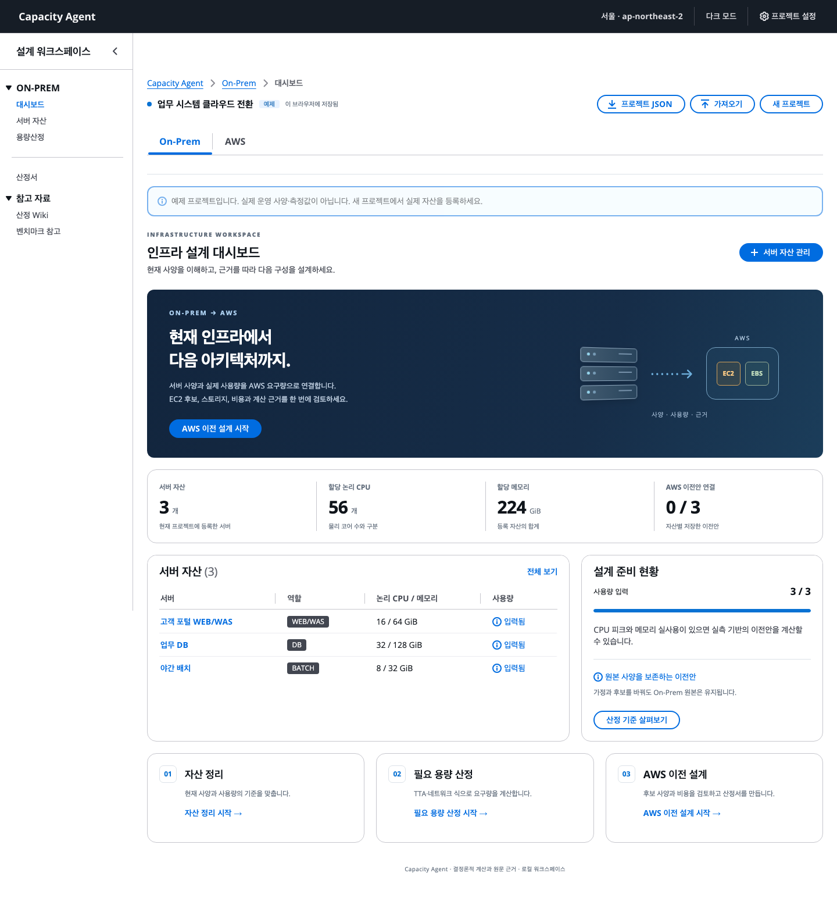

# Capacity Agent

**On-Prem 사양에서 AWS 이전 설계와 산정서까지.** 현재 서버의 사양·사용량을 정리하고, 결정론적 계산으로 EC2·EBS 후보와 비용을 비교하는 Cloudscape 대시보드입니다.



## 할 수 있는 일

- **On-Prem**: 서버 자산 등록·수정, CSV 가져오기, TTA R3·두 네트워크 기준의 21개 용량산정식 실행.
- **AWS**: 실측 사용량 또는 확정 사양 → 성장·장애·호환성 가정 → EC2·gp3 후보 비교 → 이전안 저장.
- **검토·산출물**: 같은 자산의 이전안 복제·비교, 계산 과정·출처를 포함한 산정서, 인쇄/PDF, 프로젝트 JSON 백업·재계산 가져오기.
- **LLM Wiki**: 36개 출처의 요약·개념·계산 규칙·보안 참고 자료 51페이지 검색. TPC-C·SPC-1/SPC-1C·SPEC 공식 링크.

AWS 카탈로그는 **서울 리전 C8i/M8i/R8i/C8g/M8g/R8g 36개 사양**, 공식 사양 확인일 2026-09-27, 가격표 발행일 2026-09-25의 스냅샷입니다. 비용은 EC2 On-Demand + gp3의 월 예상 소계입니다. 사양 충족과 실제 처리 성능·이전 적합성은 구분합니다.

## 시작하기

Python 3.10 이상과 Node.js 24 LTS를 권장합니다. 저장소 루트에서 실행합니다.

```sh
python3 -m venv .venv
source .venv/bin/activate
python -m pip install -r requirements-web.txt
npm ci --prefix web
npm run --prefix web build
python -m uvicorn capacity_web.app:app --host 127.0.0.1 --port 8765
```

**[http://127.0.0.1:8765](http://127.0.0.1:8765)** 에 접속해 `예제로 둘러보기`를 누르거나 새 서버를 등록하세요. 예제는 실제 운영 측정값이 아닙니다. 프로젝트는 해당 브라우저의 로컬 저장소에 보관하며 `프로젝트 JSON`으로 백업할 수 있습니다.

원본 파일·AWS 계정·API 키 없이 실행됩니다. 설치 후 계산·Wiki 조회에는 외부 네트워크가 필요하지 않습니다. 공식 링크를 여는 동작만 외부 사이트로 이동합니다.

## 검증

```sh
make check                         # Wiki·출처 계약 + Python 71개 테스트
make engine-smoke                  # 세 프로파일 JSON CLI
npm run --prefix web build         # TypeScript + production build
cd web
npx playwright install chromium    # 최초 브라우저 설치
npm run test:e2e                    # 실제 브라우저 흐름·접근성
```

[검증 기록](docs/WEB_VERIFICATION.md)에 독립 산술, API, 브라우저, 인쇄와 검증 범위를 정리했습니다. GitHub Actions도 원본 없는 체크아웃에서 같은 게이트를 실행합니다.

## 원본과 공개 범위

`reference/` 원본 PDF·엑셀·HWP, `wiki/sources/extracted/` 전체 추출본, 사용자 프로젝트·환경변수·키·로그·빌드 결과는 `.gitignore`로 공개 대상에서 제외합니다. 공개 Wiki는 원문을 그대로 배포하는 저장소가 아니라 출처에 연결된 요약과 계산 규칙입니다.

원본이 없으면 화면에 `원본 별도`를 표시합니다. manifest에 등록된 파일을 로컬에 추가하면 원문 링크를 이용할 수 있습니다. 전체 원본 묶음이 있는 환경의 `make check`는 파일 해시까지 검사합니다. 강제 원본 검사는 `make check-sources`입니다.

## 설계와 다음 단계

| 문서 | 내용 |
| --- | --- |
| [웹 사용법](docs/WEB_USAGE.md) | 실행, 화면별 흐름, CSV·JSON·인쇄 |
| [화면·기능 계획](docs/WEB_PLAN.md) | On-Prem/AWS 정보 구조와 실제 구현 범위 |
| [마이그레이션 설계](docs/MIGRATION_DESIGN.md) | 실측·확정 사양, 고정 메모리·분산·gp3·가격 계약 |
| [계산 엔진](docs/ENGINE_USAGE.md) | Python API·CLI·입력 예제 |
| [Wiki](wiki/index.md) | 출처·개념·계산식·알려진 불일치 |
| [제품 계획](docs/PRODUCT_PLAN.md) / [다음 작업](docs/NEXT_PLAN.md) | Wiki 에이전트와 설계·보안 검토 확장 |

현재 계산은 Python 도구가 수행합니다. LLM 연결, 실제 AWS 데이터 이관·리소스 생성, 공동 편집·인증은 후속 범위입니다.
