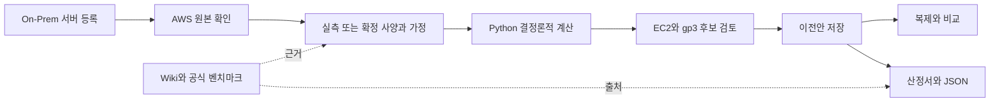

# Cloudscape 웹 계획·구현 명세

2026-09-27. On-Prem / AWS를 상위 탭으로 두고 **On-Prem 사양 → AWS 마이그레이션**을 중심으로 구현한다. 인프라 TA·설계자가 입력부터 후보·근거·산정서를 만들고 검토자가 재현할 수 있는 로컬 도구다. [수치 설계](MIGRATION_DESIGN.md), [제품 로드맵](PRODUCT_PLAN.md), [검증 기록](WEB_VERIFICATION.md)을 함께 관리한다.

## 화면과 기능

| 메뉴 | 사용자 작업 | 실제 구성 |
| --- | --- | --- |
| On-Prem · 대시보드 | 자산 수·논리 CPU·메모리·이전안 연결, 빈 상태·예제 시작 | AppLayout, Tabs, Container, ColumnLayout |
| On-Prem · 서버 자산 | 단일 서버/VM 등록·수정·삭제·검색, CSV 양식/가져오기 | Table, Modal, FormField, Input, Select |
| On-Prem · 용량산정 | 세 프로파일 21식의 입력·단위·옵션·근거, 실시간 결과·전체 결과·JSON | Tabs, FormField, ExpandableSection, Table |
| AWS · 마이그레이션 개요 | 현재 자산별 최근 이전안, EC2·EBS 연결과 비용 산정 범위 | Container, ColumnLayout, 논리 연결 도식 |
| AWS · 이전 설계 | 원본→이전 조건→EC2·gp3 후보→검토·저장 | 4단계 Wizard, Table, SplitPanel, Checkbox |
| AWS · 이전안·시나리오 | 당시 원본 유지, 복제·삭제, 같은 자산의 2개 이전안 비교 | Table, Decimal 차이·변화율 |
| 공통 · 산정서 | 원본·가정·계산·비용·한계·출처, 인쇄/PDF·개별 JSON | 독립 article, 인쇄 CSS, Table |
| 공통 · 산정 Wiki | 51문서 제목·본문 검색, 분류, 출처 카드·개념·보안 자료 | TextFilter, Select, Markdown/GFM |
| 공통 · 벤치마크 참고 | TPC-C·SPC-1/SPC-1C·SPEC 공식 링크와 확인일 | Table, Link, 비교 조건 안내 |
| 프로젝트 도구 | 한 프로젝트 이름 변경·새로 만들기·JSON 백업/가져오기 | localStorage, Modal, Flashbar |

처음에는 자산이 없는 화면을 보인다. 사용자가 명시적으로 예제를 불러오면 합성 프로젝트라는 표시를 유지한다. 프로젝트 서버 저장·목록·공동 편집은 후속 범위다.

## 대표 흐름

On-Prem 계산기는 AWS 마법사와 별도다. 프로파일을 선택하고 좌측 계산 항목에서 필요한 입력을 수정한다. 한 프로파일의 계산 묶음을 함께 실행해 참조·일관성을 확인한다. TTA와 두 네트워크 모델의 계수를 섞지 않는다.

## 수치·저장 계약

- 계산은 `capacity_engine`과 `capacity_web.migration`이 소유한다. 프런트엔드는 십진 문자열을 보내고 Decimal로 표시·집계·차이를 계산한다.
- 비어 있는 필드는 0으로 채우지 않는다. 원문 MB/MiB 구분, 출처·기준일·단위·변수별 조건은 코어 계약을 따른다.
- On-Prem 입력은 350ms 지연 후 재계산하고 이전 응답을 무효화한다. AWS 조건을 바꾸면 과거 후보·선택·확인을 폐기한다.
- 저장은 완성한 계산/선택 후보만 허용한다. 원본 자산을 수정·삭제해도 이전안의 당시 입력·결과·출처는 보존한다.
- AWS 시나리오는 같은 자산·리전·모델만 수치 비교한다. 비용은 동일한 EC2·gp3 범위이며 On-Prem 절감률로 표현하지 않는다. 기준값 0이면 변화율은 미산정이다.
- 프로젝트 JSON은 최대 5MB, 자산 200개·이전안 50개·On-Prem 산정 30개다. API 계산 요청은 2MB, CSV는 1MB다.
- 가져온 결과는 현재 엔진으로 재계산한다. 검증 실패·손상된 로컬 저장값·저장 공간 부족 시 기존 데이터를 덮어쓰지 않거나 백업 경로를 안내한다.

## 근거와 출력

후보 우측 패널은 지속 네트워크·EBS 한도, 요구량 대비 여유, 공식 URL·SKU·확인일을 표시한다. 원본·EC2·gp3 연결은 논리 매핑이며 완성된 VPC 구성도로 표현하지 않는다.

산정서는 HTML 미리보기, 브라우저 PDF 저장, JSON을 지원한다. 인쇄 본문을 별도 루트에 복제해 탐색 UI 없이 A4로 출력한다. 원본 사양·실측 기준일·전체 가정·식·값·비용 범위·가격 조건·참고 문헌이 포함된다. On-Prem 결과의 유리수 정확값은 분자/분모와 JSON에 보존한다.

공개 버전에는 전체 원문을 포함하지 않는다. Wiki 출처 ID·해시·물리 페이지/시트·셀은 유지하며 로컬 파일이 있으면 원문 링크를 활성화한다. 벤치마크의 종류·버전·조건이 달라 직접 비교할 수 없다는 점을 설명한다. 실제 벤치마크 레코드의 자동 수집/입력 UI는 후속이다.

## 기술 구조

React·TypeScript·Vite·Cloudscape의 한국어 UI, FastAPI HTTP 어댑터, Python Fraction/Decimal 코어로 나눈다. 모델·AWS 계정 없이 동작하고 런타임에 외부 가격 API를 호출하지 않는다. AWS 카탈로그는 공식 URL·날짜·해시를 보존한 한정된 스냅샷이다.

| API | 역할 |
| --- | --- |
| `GET /api/health`, `/api/bootstrap`, `/api/catalog` | 실행 상태·양식·문서 메타데이터·AWS 사양 |
| `POST /api/calculate`, `/api/migrate` | 기존 21식과 별도 마이그레이션 계산 |
| `POST /api/benchmarks/compare` | 기존 벤치마크 비교 계약 |
| `GET /api/documents/{id}`, `/api/search` | 등록 Wiki 문서와 본문 검색 |
| `GET /api/sources/{id}/original` | manifest에 등록되고 로컬에 존재하는 원본만 제공 |

초기 서버는 loopback 전용이다. 임의 파일 경로를 조회하지 못하게 하고, 중복 JSON 키·NaN·잘못된 UTF-8·큰 본문을 거부한다. 공개 호스팅·인증·협업 저장은 별도 설계가 필요하다.

## 디자인과 완료 조건

Cloudscape 컴포넌트와 밝은 업무 화면, 명확한 좌측 메뉴, On-Prem/AWS 탭, 표 중심의 후보 비교를 사용한다. 서버·EC2·EBS 색상은 유형 구분이며 추천 순위가 아니다. 다크 모드·390px 화면·키보드·폼 라벨·오류/빈 상태·인쇄를 실제 브라우저로 확인한다.

완료 게이트는 기존 원문/규칙 검사·Python 테스트, 타입·production 빌드, 브라우저 자산→AWS→후보→저장→복제/비교→JSON 재계산→PDF, 접근성 자동 검사다. 공개 배포는 원본·전체 추출·환경정보를 제외한 GitHub 코드 저장소에 한정하고 새 체크아웃의 재현성을 확인한다.

P3에는 Wiki 검색·요구사항 에이전트, 제품/버전별 보안 점검표·증적 추적을 이어간다. 현재 UI는 실제 AWS 이전이나 취약점 점검을 수행하지 않는다.
